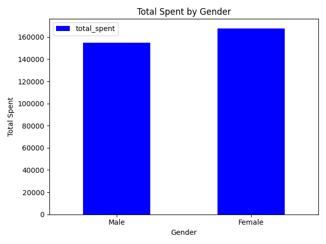
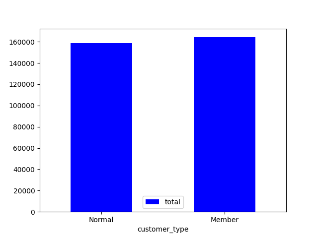
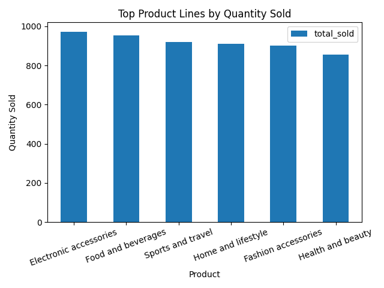
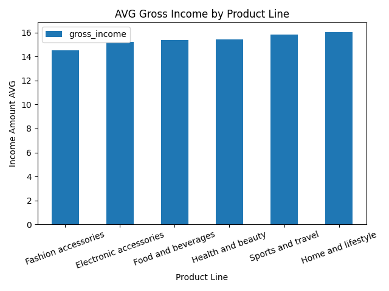
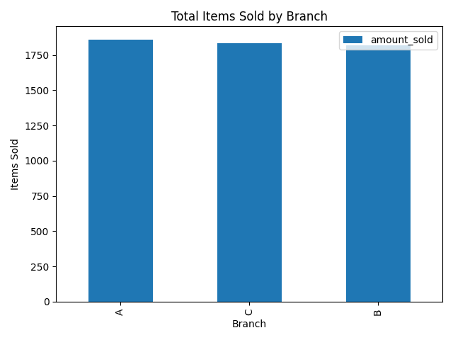
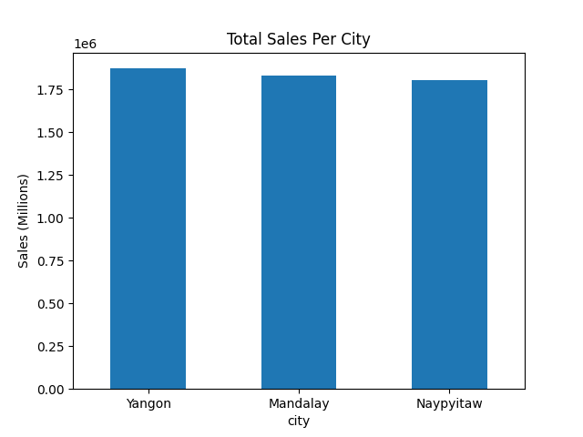
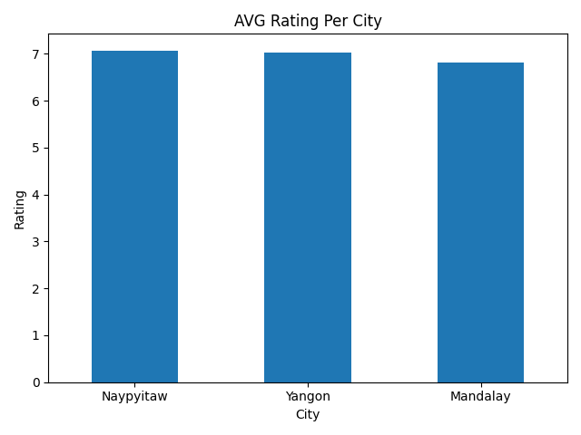
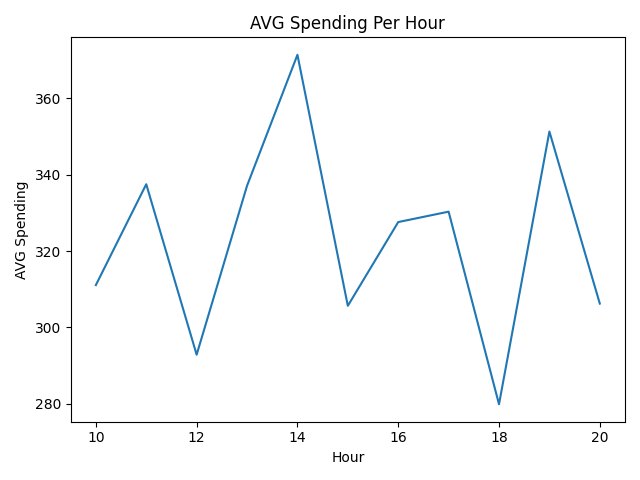

# Supermarket Sales Analysis (SQL + Python)

## Overview
This project explores customer behavior, product sales, and store performance using a supermarket sales dataset. The data was ingested and cleaned using Python, then analyzed through a series of SQL queries. Insights focus on demographic trends, high-performing products, and geographical sales distributions.

## Technologies Used
- Python: for CSV ingestion and data preprocessing
- MySQL Workbench: for executing relational queries across multiple tables
- Pandas & CSV Libraries: for manipulating raw data
- Matplotlib / Seaborn (optional): for visualizations

## Dataset Structure
- customers: gender, customer type, invoice ID
- products: product line, unit price, quantity, invoice ID
- sales: total, gross income, invoice ID
- stores: branch, city, invoice ID

## Data Workflow Summary
- Created main MySQL tables
- Imported CSV into a staging table via Python
- Moved data from staging to main tables
- Renamed staging table to backup
- Performed SQL analysis and visualized results in Python

## Financial Summary
- Total gross income: 15,380.05

## Customer Demographics and Spending Behavior
<table>
<tr>
<td></td>
<td></td>
</tr>
</table>  

- Gender distribution: 501 females, 499 males
- Spending by gender:
  - Female: 167,883.26 total; 7,994.76 gross income
  - Male: 155,084.17 total; 7,385.29 gross income
- Customer type breakdown:
  - Female Members: 261
  - Male Members: 240
  - Female Normal: 240
  - Male Normal: 259
- Average spending per customer type:
  - Members: 327.79
  - Normal: 318.12
- Payment method popularity:
  - Ewallet: 345
  - Cash: 344
  - Credit Card: 311

## Product Performance
<table>
<tr>
<td></td>
<td></td>
</tr>
</table>

- Top product lines by quantity sold:
  - Electronic Accessories: 971
  - Food & Beverages: 952
  - Sports & Travel: 920
  - Home & Lifestyle: 911
  - Fashion Accessories: 902
  - Health & Beauty: 854
- Gross income by product line:
  - Home & Lifestyle: 16.03
  - Sports & Travel: 15.81
  - Health & Beauty: 15.41
  - Food & Beverages: 15.37
  - Electronic Accessories: 15.22
  - Fashion Accessories: 14.53
- Average product ratings:
  - Food & Beverages: 7.11
  - Fashion Accessories: 7.03
  - Health & Beauty: 7.00
  - Electronic Accessories: 6.92
  - Sports & Travel: 6.91
  - Home & Lifestyle: 6.84
- Most expensive unit prices:
  - Invoice 148-41-7930: $99.96 (Health & Beauty)
  - Invoice 219-22-9386: $99.96 (Sports & Travel)
  - Invoice 641-62-7288: $99.92 (Home & Lifestyle)
  - Invoice 437-53-3084: $99.89 (Fashion Accessories)
  - Invoice 667-92-0055: $99.83 (Health & Beauty)
- Highest cost of goods sold (COGS):
  - Fashion Accessories, Invoice 860-79-0874: $993.00
  - Fashion Accessories, Invoice 687-47-8271: $989.80
  - Food & Beverages, Invoice 283-26-5248: $985.20
  - Home & Lifestyle, Invoice 751-41-9720: $975.00

## Transaction Highlights
- High quantity invoices (10 items ordered):
  - 137-63-5492
  - 139-20-0155
  - 148-82-2527
  - 149-61-1929
  - 157-13-5295

## Regional and Store Trends
<table>
<tr>
<td></td>
<td></td>
<td></td>
</tr>
</table>

- Items sold by branch:
  - A: 1,859
  - C: 1,831
  - B: 1,820
- Sales by city:
  - Yangon: 1,873,400
  - Mandalay: 1,829,320
  - Naypyitaw: 1,807,280
- City ratings (average):
  - Naypyitaw: 7.07
  - Yangon: 7.03
  - Mandalay: 6.82

## Time-Based Performance
<table>
<tr>
<td></td>
</tr>
</table>

- Average customer spending by hour:
  - 10: 311.10
  - 11: 337.53
  - 12: 292.88
  - 13: 337.12
  - 14: 371.43
  - 15: 305.68
  - 16: 327.61
  - 17: 330.34
  - 18: 279.90
  - 19: 351.32
  - 20: 306.26
- Monthly sales:
  - January: 116,292.11
  - February: 97,219.58
  - March: 109,455.74

